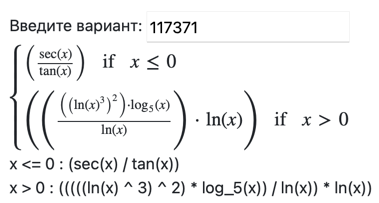
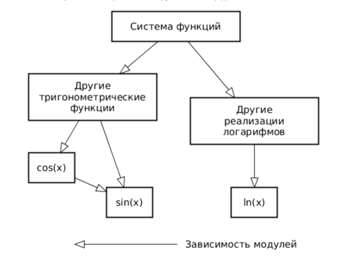

# Software-Testing
Лабораторные работы по дисциплине "Тестирование программного обеспечения"

## Лабораторная работа #1
1. Для указанной функции провести модульное тестирование разложения функции в степенной ряд. Выбрать достаточное тестовое покрытие.
2. Провести модульное тестирование указанного алгоритма. Для этого выбрать характерные точки внутри алгоритма, и для предложенных самостоятельно наборов исходных данных записать последовательность попадания в характерные точки. Сравнить последовательность попадания с эталонной.
3. Сформировать доменную модель для заданного текста.  Разработать тестовое покрытие для данной доменной модели

вариант: (117322)
- Функция arccos(x)
- Программный модуль для пирамидальной сортировки массива (http://www.cs.usfca.edu/~galles/visualization/HeapSort.html)
- Описание предметной области:
`Охранник обхватил их обоих за шеи и, почтительно поклонившись спине капитана, выволок с мостика, не обращая внимания на их сопротивление. Стальная дверь закрылась, и капитан снова остался один. Он задумчиво промурлыкал что-то и полистал свою записную книжку со стихами.`
 

Вопросы к защите лабораторной работы:

- Понятие тестирования ПО. Основные определения.
- Цели тестирования. Классификация тестов.
- Модульное тестирование. Понятие модуля.
- V-образная модель. Статическое и динамическое тестирование.
- Валидация и верификация. Тестирование методом "чёрного" и "белого" ящика.
- Тестовый случай, тестовый сценарий и тестовое покрытие.
- Анализ эквивалентности.
- Таблицы решений и таблицы переходов.
- Регрессионное тестирование.
- Библиотека JUnit. Особенности API. Класс junit.framework.Assert.
- Отличия JUnit 3 от JUnit 4.

## Лабораторная работа №2

### Задание

Провести интеграционное тестирование программы,
осуществляющей вычисление системы функций (в соответствии с вариантом).

#### Вариант: 

### Правила выполнения работы

1. Все составляющие систему функции (как тригонометрические, так и логарифмические) должны быть выражены через базовые
   (тригонометрическая зависит от варианта; логарифмическая - натуральный логарифм).
2. Структура приложения, тестируемого в рамках лабораторной работы,
   должна выглядеть следующим образом (пример приведён для базовой тригонометрической функции sin(x)):

3. Обе "базовые" функции (в примере выше - sin(x) и ln(x)) должны быть реализованы при помощи разложения в ряд с
   задаваемой погрешностью.
   Использовать тригонометрические / логарифмические преобразования для упрощения функций ЗАПРЕЩЕНО.
4. Для КАЖДОГО модуля должны быть реализованы табличные заглушки. При этом,
   необходимо найти область допустимых значений функций, и, при необходимости, определить взаимозависимые точки в модулях.
5. Разработанное приложение должно позволять выводить значения, выдаваемое любым модулем системы,
   в сsv файл вида «X, Результаты модуля (X)», позволяющее произвольно менять шаг наращивания Х.
   Разделитель в файле csv можно использовать произвольный.

### Порядок выполнения работы

1. Разработать приложение, руководствуясь приведёнными выше правилами.
2. С помощью JUNIT4 разработать тестовое покрытие системы функций,
   проведя анализ эквивалентности и учитывая особенности системы функций.
   Для анализа особенностей системы функций и составляющих ее частей можно использовать сайт https://www.wolframalpha.com/.
3. Собрать приложение, состоящее из заглушек. Провести интеграцию приложения по 1 модулю,
   с обоснованием стратегии интеграции, проведением интеграционных тестов и контролем тестового покрытия системы функций.

### Отчёт по работе должен содержать

- Текст задания, систему функций.
- UML-диаграмму классов разработанного приложения.
- Описание тестового покрытия с обоснованием его выбора.
- Графики, построенные csv-выгрузкам, полученным в процессе интеграции приложения.
- Выводы по работе.

### Вопросы к защите лабораторной работы

- Цели и задачи интеграционного тестирования. Расположение фазы интеграционного тестирования в последовательности тестов;
  предшествующие и последующие виды тестирования ПО.
- Алгоритм интеграционного тестирования.
- Концепции и подходы, используемые при реализации интеграционного тестирования.
- Программные продукты, используемые для реализации интеграционного тестирования.
  Использование JUnit для интеграционных тестов.
- Автоматизация интеграционных тестов. ПО, используемое для автоматизации интеграционного тестирования.

