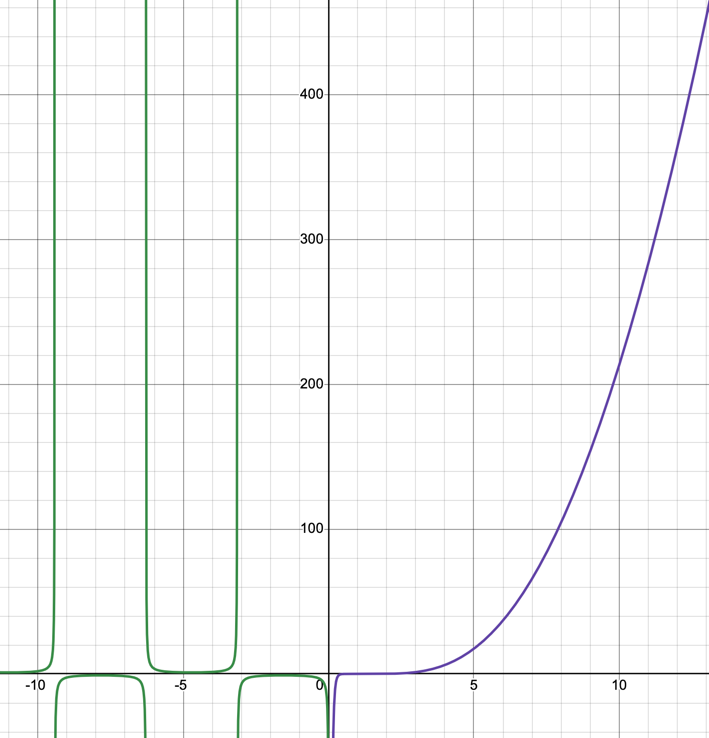
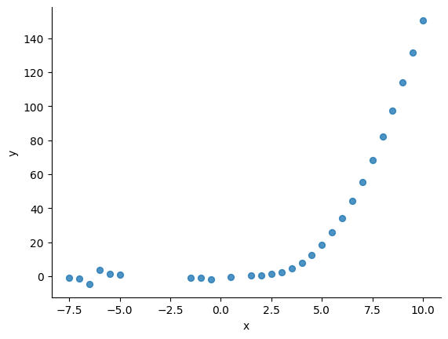

# Лабораторная работа №2

выполнил: Щербаков Александр \
группа: P33151 \
преподаватель:

### Задание

Провести интеграционное тестирование программы,
осуществляющей вычисление системы функций (в соответствии с вариантом).

#### Вариант:

### Код

можно найти по адресу https://github.com/ShchA317/Software-Testing

### Графики

ожидаемые значения:

фактические значеения: 

значение функции с `-4.64` до `-1.52` отсутсвуют,
так как в модулях копится ошибка и при нехватке точности рассматриваем деление на очень малые числа,
которые программа считает нулем.

### Вывод

В ходе выполнения работы я использовал методики модульного, интеграционного и системного тестирования

